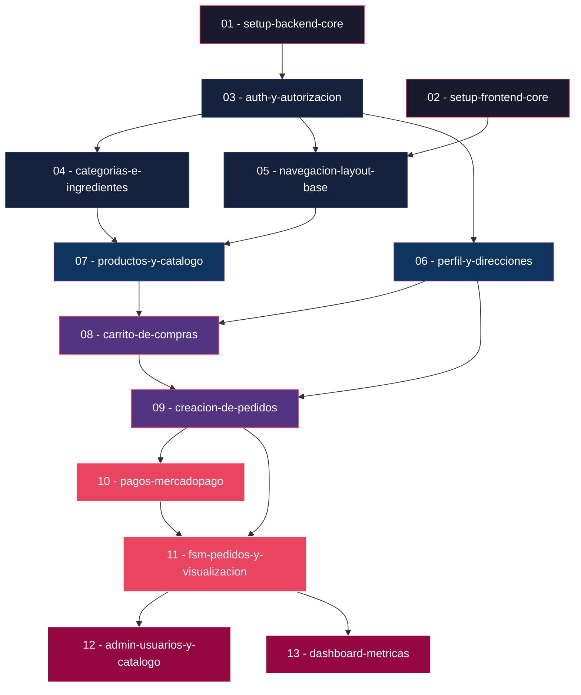

# 🍔 Food Store — Mapa Completo de Changes

> **Proyecto**: Food Store — E-commerce de alimentos  
> **Stack**: React + TypeScript + FastAPI + PostgreSQL  
> **Total HU**: 77 historias de usuario (US-000 a US-076)  
> **Total Changes**: 13 incrementos

---

## Grafo de Dependencias



---

## Criterios de Diseño

Los changes se diseñaron siguiendo estos principios:

1. **Cada change es desplegable de forma independiente** — al terminar un change, el sistema funciona (parcialmente) sin depender de los siguientes.
2. **Las dependencias son estrictas** — un change nunca usa código o tablas de un change que aún no fue archivado.
3. **Backend antes que frontend** cuando comparten change — el backend define los contratos (schemas, endpoints) que el frontend consume.
4. **Granularidad de "1-2 sprints"** — cada change es implementable en horas/días, no semanas.
5. **Las HU se agrupan por dominio funcional**, no por capa técnica.

---

## Change 01: `setup-backend-core`

| Campo | Valor |
|---|---|
| **Funcionalidad** | Scaffolding del backend FastAPI, configuración de PostgreSQL, migraciones Alembic con TODOS los modelos del ERD v5, seed data, patrones base (BaseRepository, Unit of Work, dependencias de seguridad), middleware de errores RFC 7807 |
| **Épicas** | EPIC 00 (parcial — lado backend) |
| **Historias de Usuario** | US-000 (backend), US-000a, US-000b, US-000d, US-068, US-074 |
| **Depende de** | Ninguno — es la fundación |
| **Complejidad** | 🔴 Alta |

### ¿Por qué es el primer change?

Toda la aplicación depende de la base de datos, los modelos SQLModel, las migraciones, y los patrones de infraestructura (UoW, BaseRepository, `get_current_user`, `require_role`). Sin este change, ningún módulo funcional puede existir.

### Entregables clave

- Estructura feature-first del backend
- `main.py` con FastAPI + CORS + rate limiting
- Módulo `core/`: `config.py`, `database.py`, `security.py`, `uow.py`
- `BaseRepository[T]` genérico
- Todos los modelos SQLModel del ERD v5 (16 tablas)
- Migraciones Alembic completas
- Script de seed idempotente (roles, estados pedido, formas pago, admin)
- Middleware RFC 7807 para errores
- Validación y sanitización de inputs

---

## Change 02: `setup-frontend-core`

| Campo | Valor |
|---|---|
| **Funcionalidad** | Scaffolding del frontend React + TypeScript + Vite, configuración de Tailwind CSS, Axios con interceptores JWT, TanStack Query provider, los 4 stores de Zustand, estructura FSD |
| **Épicas** | EPIC 00 (parcial — lado frontend) |
| **Historias de Usuario** | US-000 (frontend), US-000c, US-000e |
| **Depende de** | Ninguno — se puede hacer en paralelo con Change 01 |
| **Complejidad** | 🟡 Media |

### ¿Por qué se separa del backend?

El frontend no depende del backend para su setup inicial. Los stores de Zustand, la configuración de Axios y la estructura FSD son autocontenidos. Separarlo permite **trabajo en paralelo**.

### Entregables clave

- Vite + React + TypeScript (strict: true)
- Tailwind CSS + PostCSS
- Axios instance con interceptores (token + refresh automático)
- TanStack Query provider con defaults
- 4 stores Zustand: `authStore`, `cartStore`, `paymentStore`, `uiStore`
- Estructura FSD: `app/`, `pages/`, `widgets/`, `features/`, `entities/`, `shared/`
- `.env.example` con variables Vite

---

## Change 03: `auth-y-autorizacion`

| Campo | Valor |
|---|---|
| **Funcionalidad** | Sistema completo de autenticación (registro, login, refresh, logout) y autorización (RBAC con 4 roles), tanto backend como frontend |
| **Épicas** | EPIC 01 |
| **Historias de Usuario** | US-001, US-002, US-003, US-004, US-005, US-006, US-073 |
| **Depende de** | **Change 01** (modelos Usuario, Rol, UsuarioRol, RefreshToken; `get_current_user`, `require_role`; seed de roles) y **Change 02** (authStore, Axios interceptors) |
| **Complejidad** | 🔴 Alta |

### ¿Por qué aquí?

Auth es el segundo pilar. Todos los endpoints protegidos dependen de `get_current_user` y `require_role`. El frontend necesita el authStore para almacenar tokens y el interceptor de Axios para renovar sesiones automáticamente. Sin auth, no hay RBAC y sin RBAC no hay control de acceso en ningún módulo posterior.

### Entregables clave

**Backend:**
- Módulo `auth/`: register, login, refresh, logout
- Hashing bcrypt, JWT HS256, rotación de refresh tokens
- Rate limiting en login (5/15min con slowapi)
- `require_role` funcional y testeado

**Frontend:**
- Formularios de login y registro
- Integración authStore ↔ Axios interceptor
- Renovación transparente de token (US-066 se implementa aquí por estar en el interceptor)

---

## Change 04: `categorias-e-ingredientes`

| Campo | Valor |
|---|---|
| **Funcionalidad** | CRUD completo de categorías jerárquicas (con CTE recursivo) e ingredientes con flag de alérgeno |
| **Épicas** | EPIC 03, EPIC 04 |
| **Historias de Usuario** | US-007, US-008, US-009, US-010, US-011, US-012, US-013, US-014 |
| **Depende de** | **Change 03** (auth + RBAC — los endpoints requieren rol STOCK o ADMIN) |
| **Complejidad** | 🟡 Media |

### ¿Por qué se agrupan categorías e ingredientes?

Ambos son **catálogos de soporte** que los productos necesitan para existir. Un producto debe asociarse a categorías e ingredientes, así que estos deben existir primero. Son módulos independientes entre sí pero con la misma lógica de dependencia (requieren auth) y son relativamente simples.

### Entregables clave

**Backend:**
- Módulo `categorias/`: CRUD con jerarquía, CTE recursivo, validación de ciclos, soft delete con validación de productos asociados
- Módulo `ingredientes/`: CRUD con flag `es_alergeno`, soft delete

**Frontend:**
- Vistas de gestión (STOCK/ADMIN): formularios, listados, árbol de categorías
- Listado público de categorías para navegación del catálogo

---

## Change 05: `navegacion-layout-base`

| Campo | Valor |
|---|---|
| **Funcionalidad** | Layout principal, navegación adaptada por rol, protección de rutas frontend, manejo global de errores HTTP |
| **Épicas** | EPIC 02 |
| **Historias de Usuario** | US-075, US-076, US-066, US-067 |
| **Depende de** | **Change 02** (estructura FSD, authStore, uiStore) y **Change 03** (auth funcional, roles en JWT) |
| **Complejidad** | 🟡 Media |

### ¿Por qué aquí y no antes?

La navegación por rol requiere que el sistema de auth esté funcional y los roles estén en el JWT. Los route guards del frontend dependen del `authStore.hasRole()`. Se puede desarrollar en paralelo con Change 04.

### Entregables clave

- Layout principal con sidebar/navbar responsive
- Menú adaptado por rol (CLIENT, STOCK, PEDIDOS, ADMIN, anónimo)
- Route guards: `ProtectedRoute` y `RoleBasedRoute`
- Error boundary global
- Toast/notification system para errores HTTP (400, 403, 404, 429, 500)

---

## Change 06: `perfil-y-direcciones`

| Campo | Valor |
|---|---|
| **Funcionalidad** | Gestión del perfil del cliente (ver, editar, cambiar contraseña) y CRUD completo de direcciones de entrega con dirección predeterminada |
| **Épicas** | EPIC 06, EPIC 07 |
| **Historias de Usuario** | US-061, US-062, US-063, US-024, US-025, US-026, US-027, US-028 |
| **Depende de** | **Change 03** (auth — el perfil y direcciones son datos del usuario autenticado) |
| **Complejidad** | 🟡 Media |

### ¿Por qué se agrupan perfil y direcciones?

Ambos son datos personales del cliente autenticado con la misma lógica de ownership (solo ves/editás tus datos). Las direcciones son necesarias para crear pedidos (Change 09), así que deben existir antes. El perfil es un módulo pequeño que encaja naturalmente aquí.

### Entregables clave

**Backend:**
- Módulo `usuarios/` (perfil): ver perfil, editar datos, cambiar contraseña
- Módulo `direcciones/`: CRUD completo, dirección predeterminada, ownership por JWT

**Frontend:**
- Página de perfil con edición inline
- Gestión de direcciones: lista, crear, editar, eliminar, marcar predeterminada
- Cambio de contraseña con validación

---

## Change 07: `productos-y-catalogo`

| Campo | Valor |
|---|---|
| **Funcionalidad** | CRUD completo de productos con asociación a categorías e ingredientes, catálogo público con paginación/filtros/búsqueda, detalle de producto, gestión de stock, filtro por alérgenos |
| **Épicas** | EPIC 05 |
| **Historias de Usuario** | US-015, US-016, US-017, US-018, US-019, US-020, US-021, US-022, US-023 |
| **Depende de** | **Change 04** (categorías e ingredientes deben existir para asociarlos) y **Change 05** (layout y navegación para las vistas) |
| **Complejidad** | 🔴 Alta |

### ¿Por qué es el change más denso del catálogo?

Productos es el corazón del e-commerce. Requiere las relaciones M2M con categorías e ingredientes (Change 04), la interfaz base (Change 05), y genera el catálogo público que el carrito consumirá. Es el change que "habilita la tienda".

### Entregables clave

**Backend:**
- Módulo `productos/`: CRUD con relaciones M2M, soft delete, stock, disponibilidad
- Endpoint público de catálogo con paginación, filtro por categoría, búsqueda por nombre, filtro por alérgenos
- Endpoint de detalle con ingredientes y categorías anidadas

**Frontend:**
- Grid de catálogo con skeleton loaders, debounce en búsqueda, filtros
- Vista de detalle de producto con ingredientes y badge de alérgenos
- Panel de gestión de productos (STOCK/ADMIN): formulario con asociación de categorías e ingredientes
- Panel de gestión de stock

---

## Change 08: `carrito-de-compras`

| Campo | Valor |
|---|---|
| **Funcionalidad** | Carrito de compras client-side con Zustand + localStorage. Agregar, personalizar (excluir ingredientes), modificar cantidad, eliminar, vaciar, resumen con totales |
| **Épicas** | EPIC 08 |
| **Historias de Usuario** | US-029, US-030, US-031, US-032, US-033, US-034 |
| **Depende de** | **Change 07** (catálogo de productos — necesita productos para agregar al carrito) y **Change 06** (cartStore ya está definido pero ahora se conecta con productos reales) |
| **Complejidad** | 🟢 Media-Baja |

### ¿Por qué es un change separado?

Aunque el `cartStore` se definió en Change 02, la funcionalidad completa del carrito (UI del drawer, personalización de ingredientes, integración con el catálogo) requiere que los productos existan. Es 100% frontend — no toca el backend.

### Entregables clave

- CartDrawer / CartPage con listado de items
- Botón "Agregar al carrito" en catálogo y detalle de producto
- Personalización: checkboxes de ingredientes a excluir
- Controles de cantidad (+/-)
- Cálculo reactivo de subtotales y total
- Botón "Vaciar carrito" con confirmación modal
- Persistencia en localStorage verificada (cierre de browser, refresh, logout/login)

---

## Change 09: `creacion-de-pedidos`

| Campo | Valor |
|---|---|
| **Funcionalidad** | Flujo completo de creación de pedidos: validación pre-checkout (stock, precios), creación atómica con UoW (snapshots de precio y dirección), vaciado de carrito post-creación, pantalla de confirmación |
| **Épicas** | EPIC 09, EPIC 10, EPIC 14 (parcial — US-071) |
| **Historias de Usuario** | US-069, US-070, US-035, US-036, US-037, US-038, US-071 |
| **Depende de** | **Change 08** (carrito con items para convertir en pedido) y **Change 06** (direcciones de entrega para asociar al pedido) |
| **Complejidad** | 🔴 Alta |

### ¿Por qué es un change crítico?

Es la operación más compleja del sistema: una transacción atómica que valida stock, crea snapshots, inserta en 3 tablas, y registra auditoría. Es la primera demostración real del patrón Unit of Work. Separa la creación de pedidos de los pagos (Change 10) y la FSM (Change 11) para mantener cada change enfocado.

### Entregables clave

**Backend:**
- Módulo `pedidos/`: endpoint `POST /api/v1/pedidos`
- Validación de stock atómica (`SELECT FOR UPDATE`)
- Snapshots de precio y dirección
- Creación de `Pedido` + `DetallePedido[]` + `HistorialEstadoPedido` en una transacción
- Personalización como `INTEGER[]`

**Frontend:**
- Flujo de checkout: selección de dirección → resumen → confirmación
- Validación pre-checkout (disponibilidad y precios)
- Pantalla de confirmación post-creación (US-071)
- Vaciado automático del carrito

---

## Change 10: `pagos-mercadopago`

| Campo | Valor |
|---|---|
| **Funcionalidad** | Integración completa con MercadoPago: creación de órdenes de pago, procesamiento de webhooks IPN, consulta de estado de pago, reintento de pagos rechazados, feedback de retorno |
| **Épicas** | EPIC 11, EPIC 14 (parcial — US-072) |
| **Historias de Usuario** | US-045, US-046, US-047, US-048, US-072 |
| **Depende de** | **Change 09** (los pedidos deben existir en estado PENDIENTE para poder pagarlos) |
| **Complejidad** | 🔴 Alta |

### ¿Por qué separar pagos de pedidos?

La integración con MercadoPago es un dominio técnico distinto: involucra SDKs externos, webhooks asíncronos, idempotencia, y tokenización PCI. Mezclarlo con la creación de pedidos haría un change inmanejable. Además, la creación de pedidos es funcional sin pagos (el pedido queda en PENDIENTE).

### Entregables clave

**Backend:**
- Módulo `pagos/`: crear orden MP, webhook IPN, consulta de estado
- `idempotency_key` UUID por pago
- Tabla `Pago` con `mp_payment_id`, `mp_status`, `external_reference`
- Procesamiento de estados: approved, rejected, pending, in_process, cancelled
- Validación de firma/headers de MercadoPago

**Frontend:**
- `paymentStore` integrado con SDK MercadoPago React
- CardPayment embebido (tokenización PCI SAQ-A)
- Páginas de retorno: success, failure, pending
- Opción de reintento en pagos rechazados
- Polling de estado post-pago

---

## Change 11: `fsm-pedidos-y-visualizacion`

| Campo | Valor |
|---|---|
| **Funcionalidad** | Máquina de estados completa del pedido (6 estados, transiciones validadas), decremento/restauración atómica de stock, audit trail append-only, visualización de pedidos para todos los roles |
| **Épicas** | EPIC 12, EPIC 13 |
| **Historias de Usuario** | US-039, US-040, US-041, US-042, US-043, US-044, US-049, US-050, US-051, US-052 |
| **Depende de** | **Change 09** (pedidos en estado PENDIENTE) y **Change 10** (webhook de pago aprobado dispara PENDIENTE→CONFIRMADO) |
| **Complejidad** | 🔴 Alta |

### ¿Por qué se juntan FSM y visualización?

La FSM define las transiciones y la visualización las muestra. Son inseparables en la experiencia de usuario: el Gestor de Pedidos necesita ver los pedidos para avanzar su estado. Además, la transición PENDIENTE→CONFIRMADO la dispara el webhook de pagos (Change 10), así que la FSM debe venir después.

### Entregables clave

**Backend:**
- FSM en la capa de servicio: mapa de transiciones válidas
- Transición automática PENDIENTE→CONFIRMADO (por webhook)
- Transiciones manuales: CONFIRMADO→EN_PREP→EN_CAMINO→ENTREGADO
- Cancelación con restauración de stock
- Decremento atómico de stock al confirmar
- Historial append-only (solo INSERT)
- Endpoints de listado por rol y detalle con historial

**Frontend:**
- Panel del cliente: "Mis pedidos" con filtros y detalle
- Panel del gestor: todos los pedidos con acciones de avance de estado
- Timeline visual del historial de estados
- Badge de estado con colores

---

## Change 12: `admin-usuarios-y-catalogo`

| Campo | Valor |
|---|---|
| **Funcionalidad** | Panel de administración de usuarios (listar, editar roles, desactivar) y acceso Admin a gestión de catálogo y pedidos |
| **Épicas** | EPIC 15, EPIC 16 |
| **Historias de Usuario** | US-053, US-054, US-055, US-064, US-065 |
| **Depende de** | **Change 11** (la gestión de pedidos por Admin extiende la FSM y visualización) |
| **Complejidad** | 🟡 Media |

### ¿Por qué al final?

La gestión de usuarios y los privilegios extendidos de Admin son funcionalidades de "superusuario" que complementan lo que ya existe. No son bloqueantes para el flujo principal (cliente→carrito→pedido→pago). Se pueden implementar una vez que todo el flujo core esté estable.

### Entregables clave

**Backend:**
- Módulo `admin/usuarios`: listar, editar, desactivar, asignar roles
- Protección: Admin no puede quitarse el último rol ADMIN
- Invalidación de refresh tokens al cambiar rol/desactivar

**Frontend:**
- Tabla de usuarios con búsqueda y filtro por rol
- Modal/formulario de edición de usuario y asignación de roles
- Confirmación al desactivar usuario
- Endpoints de catálogo/pedidos aceptan rol ADMIN además de STOCK/PEDIDOS

---

## Change 13: `dashboard-metricas`

| Campo | Valor |
|---|---|
| **Funcionalidad** | Dashboard de administración con KPIs, gráficos de ventas, ranking de productos, distribución de pedidos por estado, y configuración del sistema |
| **Épicas** | EPIC 17, EPIC 18 |
| **Historias de Usuario** | US-056, US-057, US-058, US-059, US-060 |
| **Depende de** | **Change 11** (necesita datos de pedidos con estados para generar métricas) |
| **Complejidad** | 🟡 Media |

### ¿Por qué es el último change?

Las métricas son agregaciones sobre datos que solo existen cuando el sistema tiene pedidos, pagos y usuarios. Además, `recharts` requiere datos reales para ser útil. La configuración del sistema (US-060) es baja prioridad y complementa naturalmente el panel de admin.

### Entregables clave

**Backend:**
- Módulo `admin/metricas`: resumen general, ventas por período, top productos, pedidos por estado
- Queries con `SUM`, `COUNT`, `GROUP BY`, `DATE_TRUNC`
- Módulo `admin/configuracion`: tabla key-value

**Frontend:**
- Dashboard con KPIs: total ventas, pedidos, usuarios
- `LineChart` de evolución de ventas (recharts)
- `BarChart` de productos más vendidos
- `PieChart` de distribución por estado
- Filtros de fecha y granularidad
- Panel de configuración (key-value)

---

## Resumen Visual

| # | Change | HU cubiertas | Depende de | Complejidad |
|---|---|---|---|---|
| 01 | `setup-backend-core` | US-000, 000a, 000b, 000d, 068, 074 | — | 🔴 Alta |
| 02 | `setup-frontend-core` | US-000, 000c, 000e | — | 🟡 Media |
| 03 | `auth-y-autorizacion` | US-001 a 006, 073 | 01, 02 | 🔴 Alta |
| 04 | `categorias-e-ingredientes` | US-007 a 014 | 03 | 🟡 Media |
| 05 | `navegacion-layout-base` | US-075, 076, 066, 067 | 02, 03 | 🟡 Media |
| 06 | `perfil-y-direcciones` | US-061 a 063, 024 a 028 | 03 | 🟡 Media |
| 07 | `productos-y-catalogo` | US-015 a 023 | 04, 05 | 🔴 Alta |
| 08 | `carrito-de-compras` | US-029 a 034 | 06, 07 | 🟢 Media-Baja |
| 09 | `creacion-de-pedidos` | US-035 a 038, 069, 070, 071 | 06, 08 | 🔴 Alta |
| 10 | `pagos-mercadopago` | US-045 a 048, 072 | 09 | 🔴 Alta |
| 11 | `fsm-pedidos-y-visualizacion` | US-039 a 044, 049 a 052 | 09, 10 | 🔴 Alta |
| 12 | `admin-usuarios-y-catalogo` | US-053 a 055, 064, 065 | 11 | 🟡 Media |
| 13 | `dashboard-metricas` | US-056 a 060 | 11 | 🟡 Media |

---

## Ruta Crítica

La ruta crítica (camino más largo hasta completar el proyecto) es:

```
01 → 03 → 04 → 07 → 08 → 09 → 10 → 11 → 12/13
```

Los changes **paralelizables** son:
- **01 y 02** — backend y frontend setup son independientes
- **04 y 05 y 06** — una vez terminado Change 03, estos tres se pueden hacer en paralelo
- **12 y 13** — ambos dependen de 11 pero no entre sí

---

## Notas de Implementación

> [!IMPORTANT]
> **Cada change debe archivarse antes de empezar el siguiente** que dependa de él. Las specs generadas en el archivo se vuelven contexto para los changes posteriores.

> [!TIP]
> **Empezar por Changes 01 y 02 en paralelo** es la forma más eficiente de arrancar. Ambos son independientes y al terminarlos, Change 03 puede comenzar con toda la infraestructura lista.

> [!WARNING]
> **Change 09 (creación de pedidos)** es el más riesgoso técnicamente. Es la primera prueba real del Unit of Work con transacciones atómicas multi-tabla. Recomiendo invertir tiempo extra en el diseño de este change.
